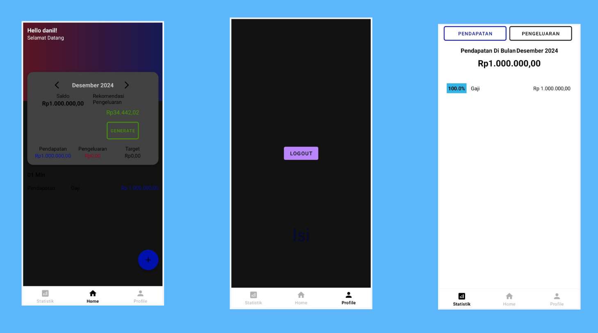

# 💸 Daily Spending Predictor – Machine Learning Module

**Daily Spending Predictor** is a machine learning module that estimates users' daily spending limits based on their monthly income and savings goals. This project is part of the **Bangkit Academy 2024 Bacth 2 Capstone Project**, a program supported by Google, Traveloka, and Gojek.

> 📌 This repository contains the **prediction module (Dense Neural Network model)** developed by the Machine Learning team. The frontend application and cloud deployment are hosted in separate repositories.

---
## Summary
Gen Z often struggles with managing finances due to limited tools, leading to impulsive spending. To address this, we developed Budgy, a user-friendly app that tracks expenses and provides personalized recommendations, helping users make smarter financial decisions and stay on track with their goals.

**BUDGY - Saving today for a brighter tomorrow.**

---
## Team Information

**Team ID:** C242-PS508  
**Capstone Team – Daily Spending Predictor**

| Name                        | Learning Path        |
|-----------------------------|----------------------|
| Iqbal Maulana Asyari        | Mobile Development   |
| Abiyyatun Nazihah           | Cloud Computing      |
| Tubagus Rusli Sumirat       | Cloud Computing      |
| Danil Fadhlurrahman Alwi    | Machine Learning     |
| Sultan Abdul Malik          | Machine Learning     |
| Karunia Rizqi Artyanto      | Machine Learning     |

---

## About the Model

The prediction model is built using a **Dense Neural Network (DNN)**, trained to estimate daily spending limits based on the following inputs:

- Monthly income
- Monthly savings target
- (Optionally) historical spending ratio

The model is optimized and deployed to **Google Cloud Platform (GCP)** as a RESTful API service.

---
## Documentation

